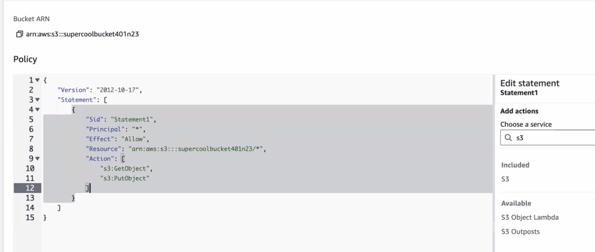
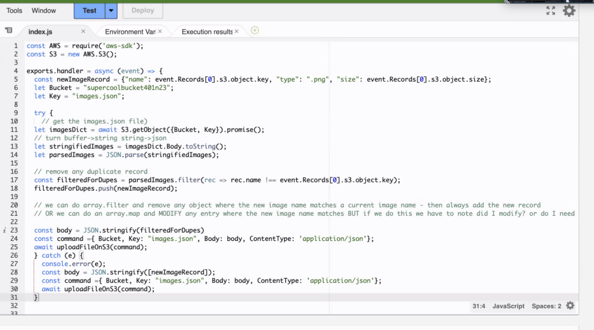
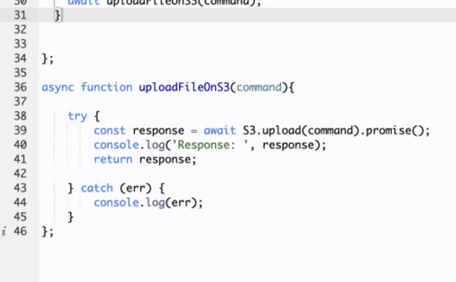

# AWS: S3 and Lambda

AWS Lambda allows us to write code that is triggered in the cloud, without thinking about maintaining servers. This is practice integrating a Lambda Function.

## Before You Start

Make sure your IAM User has permissions 'AmazonS3FullAccess' & 'AWSLambda_FullAccess'.

## S3

- console -> S3 -> create bucket
- add a name, then click create bucket
- set up permissions with a permissions policy

- Here's a breakdown of what this policy is saying:
  - Version: This specifies the version of the policy language. In this case, it's using version "2012-10-17," which is a common version.
  - Statement: This is an array of policy statements. In your example, there's only one statement.
    - Sid: This is just a unique identifier for the statement. It doesn't affect the policy's functionality but can be useful for reference.
    - Principal: "*" means that this policy applies to any AWS principal. In other words, it grants permissions to any AWS account or user.
    - Effect: "Allow" means that the actions specified in this statement are allowed.
    - Resource: "arn:aws:s3:::awspracticebucketforthewin/*" is the Amazon Resource Name (ARN) of the resource to which this policy applies. In this case, it's an S3 bucket named "awspracticebucketforthewin" and all objects within that bucket (indicated by /*).
    - Action: This is an array of actions that are allowed. The policy allows two actions:
      - "s3:GetObject": This action allows any AWS principal to retrieve (read) objects from the specified bucket.
      - "s3:PutObject": This action allows any AWS principal to upload (write) objects to the specified bucket.
     
## Lambda

- console -> Lambda -> create function
- add a name, runtime: node.js 16, then click create function
  - const AWS = require('aws-sdk');
  - const S3 = new AWS.S3();

- what our class code looked like:

- To accesss a record in the S3 Bucket we ran: await S3.getObject({Bucket, Key}).promise();
  - the Bucket should match the S3 Bucket's name
  - in our case the key matched the name of a file we uploaded to our S3 Bucket
    - I would imaging there are other ways to use the Key to get data

- To create a trigger we:
  - clicked on triggers then hit the first dropdown and selected our S3 Bucket
  - for the Event Type dropdown we selected: All object create events

- To grab our event data / important image meta data that we were supposed to store for this assignment we had to dig down into the event object.
  The AWS event object will look somewhat like this: 

  {

  "Records": [

    {

      "eventVersion": "2.0",
      "eventSource": "aws:s3",
      "awsRegion": "us-east-1",
      "eventTime": "1970-01-01T00:00:00.000Z",
      "eventName": "ObjectCreated:Put",
      "userIdentity": {
        "principalId": "EXAMPLE"
      },
      "requestParameters": {
        "sourceIPAddress": "127.0.0.1"
      },
      "responseElements": {
        "x-amz-request-id": "EXAMPLE123456789",
        "x-amz-id-2": "EXAMPLE123/5678abcdefghijklambdaisawesome/mnopqrstuvwxyzABCDEFGH"
      },
      "s3": {
        "s3SchemaVersion": "1.0",
        "configurationId": "testConfigRule",
        "bucket": {
          "name": "example-bucket",
          "ownerIdentity": {
            "principalId": "EXAMPLE"
          },
          "arn": "arn:aws:s3:::example-bucket"
        },
        "object": {
          "key": "test%2Fkey",
          "size": 1024,
          "eTag": "0123456789abcdef0123456789abcdef",
          "sequencer": "0A1B2C3D4E5F678901"
        }
      }
    }
]
}

  We needed to home into the 'Records' property 0th array index then into the 's3' property then farthur into the 'object' property to get the infor we were looking for.